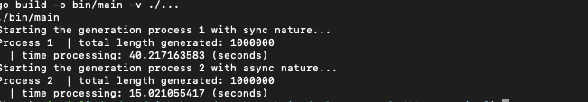

## 01, data and pointer

inside this folder you will see the example of using pointer

## 02, use `defer`

in this example you will see theexample of using `defer` in golang

## 03, use `goroutine`

example of using `goroutine` in long process,
benchmark:

